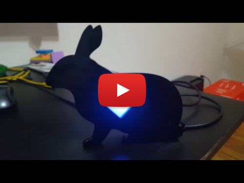

# arduino-bunny-nightlight
An Arduino nightlight that looks like a bunny.

# Final Product

# Inspiration
I was inspired by [this blog post] on Sparkfun. However, I wanted to do something more complex in terms of lightning. The bunny shape was laser cut from acrylic and a simple board was assembled to host two RGB LEDs that connected, along with a button to an Arduno Nano board.

There are three modes for this nighlight:

1. solid color (five colors pre-loaded; those can be rotated through by a short button press)
The single button press controls the light mode:
2. pulsating color (same five colors; those can also be rotated through by a short button press)
3. crossfading light (uses the same five colors).

The long button press activates one of the sleep mode durations (turning the current light off after 15 / 30 / 60 minutes). A short button press after the sleep mode was activated will cancel it.

# What's Included
1. Eagle schematics for the board[1](#f1)
2. Arduino sketch
 
# What's Not Included
1. The bunny shape vector was not included; you can purchase one from a variery of sites, and it does not even have to be a bunny!

License
----

MIT

Footnotes
----
<b name="f1">1</b> Funny story. I only had a chance to make two iterations of the board and it was my very first time manufacturing a PCB. Being a lengthy and expensive process, I never had the patience to wait for the last iteration of the board to arrive and instead made the LED circuit using a piece of prototyping board. I also used an Arduino Nano instead of a standalone controller that's present in the circuit diagram. Long story short - the circuit included here is about right, but I am not sure if the PCB actually works since it was not untested. [↩](#a1)
[this blog post]:https://learn.sparkfun.com/tutorials/elasto-nightlight
